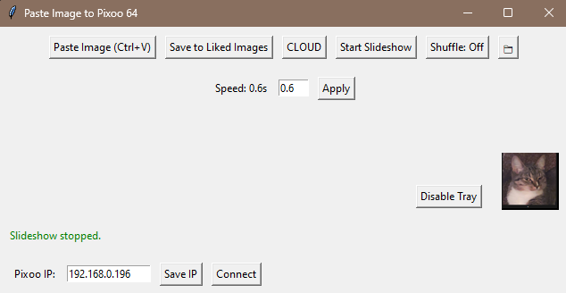

# paste2pixoo

A Python application to control and display images on a **Pixoo 64** device. This app allows you to paste images from your clipboard, save them to a "liked images" folder, and run a slideshow of saved images. It also includes a graphical user interface (GUI) and system tray integration for easy access.

---

## Features

- **Paste and Display Images**: Paste images from your clipboard and display them on the Pixoo 64 device.
- **Save Liked Images**: Save resized images to a "liked images" folder for later use.
- **Slideshow Mode**: Run an endless slideshow of images from the "liked images" folder.
  - Shuffle images for a random slideshow experience.
  - Adjust slideshow speed dynamically.
- **System Tray Integration**: Minimize the app to the system tray for quick access.
- **CLOUD Channel Support**: Switch the Pixoo 64 to CLOUD channel directly from the app.
- **Cross-Platform**: Works on Windows, macOS, and Linux (with appropriate adjustments for file paths and commands).

---

## Screenshots

  
*Example: GUI of the paste2pixoo.*

---

## Installation

### Prerequisites
- Python 3.7 or higher
- Pixoo 64 device
- Required Python libraries: `pixoo`, `Pillow`, `tkinter`, `pystray`

### Steps
1. Clone the repository:
   ```bash
   git clone https://github.com/your-username/pixoo-image-controller.git
   cd pixoo-image-controller
   ```
2. Install the required dependencies:
   ```bash
   pip install -r requirements.txt
   ```
3. Run the application:
   ```bash
   python gui.py
   ```

---

## Usage

1. **Connect to Pixoo 64**:
   - Enter the IP address of your Pixoo 64 device in the IP entry box and click "Connect".
   - Save the IP address for future use by clicking "Save IP".

2. **Paste and Display Images**:
   - Copy an image to your clipboard.
   - Click "Paste Image" or press `Ctrl+V` to display the image on the Pixoo 64.

3. **Save Liked Images**:
   - After pasting an image, click "Save to Liked Images" to save it to the "liked images" folder.

4. **Run Slideshow**:
   - Click "Start Slideshow" to begin a slideshow of images from the "liked images" folder.
   - Use the "Shuffle" button to toggle shuffle mode.
   - Adjust the slideshow speed using the speed entry box and click "Apply".

5. **System Tray**:
   - Minimize the app to the system tray by closing the window.
   - Restore the app by clicking "Restore" in the system tray menu.

6. **Switch to CLOUD Channel**:
   - Click "CLOUD" to switch the Pixoo 64 to CLOUD channel.

---

## File Structure

```
pixoo-image-controller/
├── gui.py                  # Main application script
├── requirements.txt        # List of dependencies
├── pixoo_ip.txt            # Saved Pixoo IP address and slideshow speed
├── liked_images/           # Folder for saved images
├── temp_resized_image.png  # Temporary resized image file
└── README.md               # Project description
```

---

## Compiling to Executable

To compile the app into a standalone `.exe` file, use **PyInstaller**:
```bash
pyinstaller --onefile --windowed --icon=app_icon.ico gui.py
```
- Replace `app_icon.ico` with the path to your custom icon file.

---

## Contributing

Contributions are welcome! If you find any issues or have suggestions for improvements, please open an issue or submit a pull request.

---

## License

This project is licensed under the **MIT License**. See the [LICENSE](LICENSE) file for details.

---

## Acknowledgments

- **Pixoo 64**: Thanks to the creators of the Pixoo 64 device for their amazing product.
- **PyInstaller**: For making it easy to compile Python scripts into executables.
- **Pillow, tkinter, and pystray**: For providing the tools to create a user-friendly GUI and system tray integration.

---
